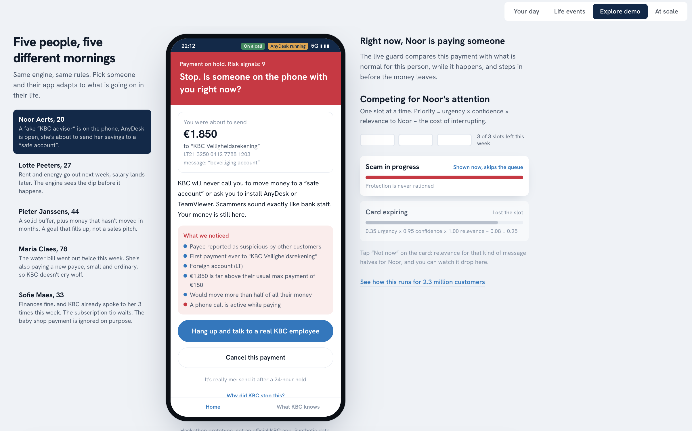
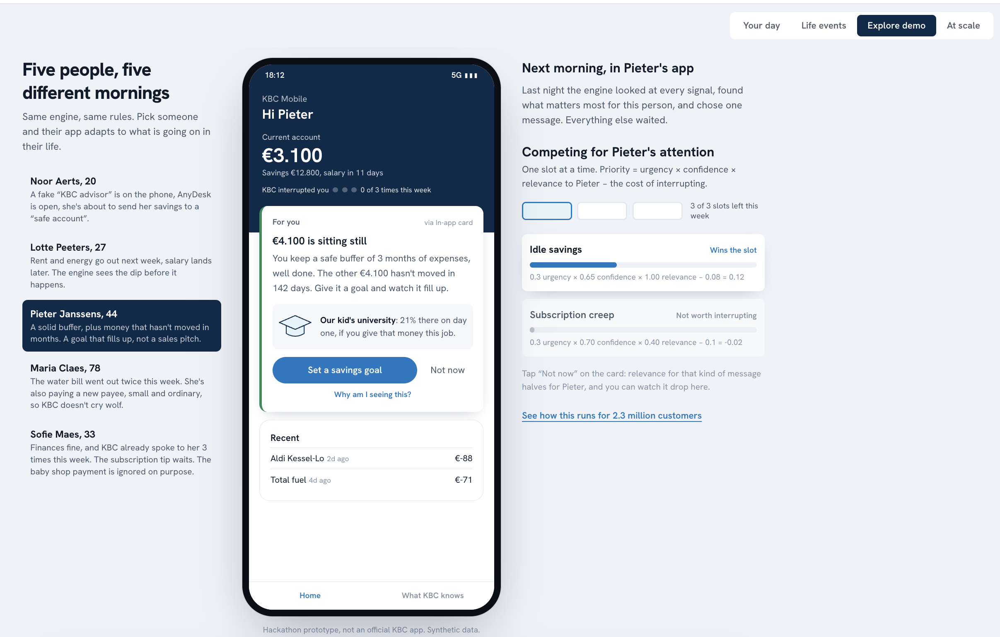
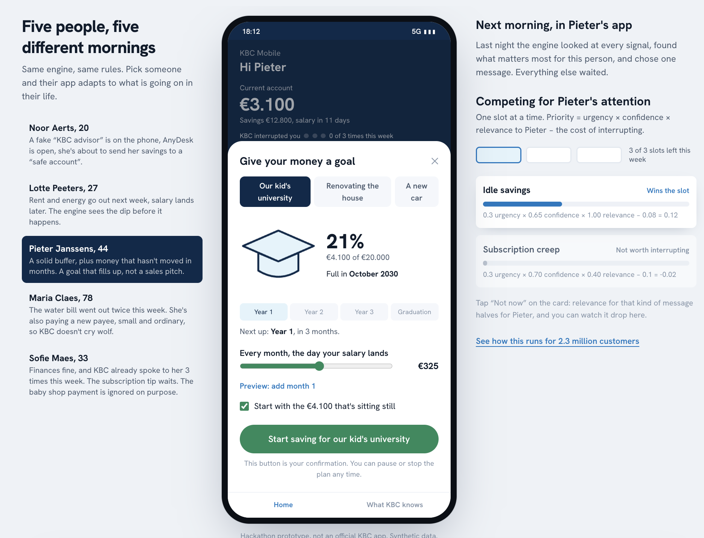
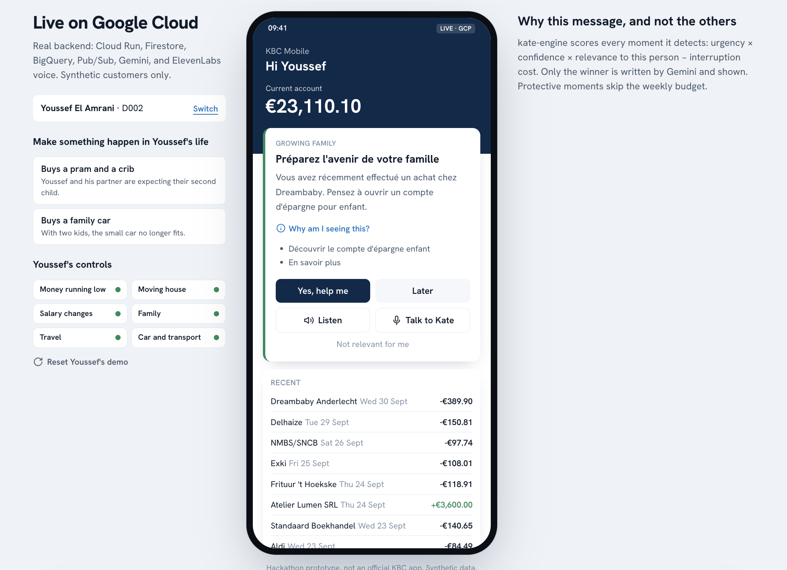
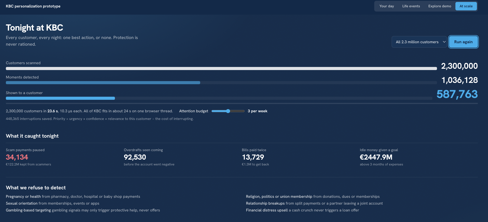

# Ahead

A bank knows a lot about its customers. The hard part is saying one useful thing at the right moment, and staying quiet the rest of the time.

## What it does

- **Detects moments** from transactions and context: scam calls in progress, upcoming overdrafts, duplicate bills, idle savings, life events.
- **Picks one message at most.** Every moment competes for the customer's attention: `priority = urgency × confidence × relevance − cost`, within a weekly budget. Scam protection always gets through.
- **Explains itself.** Every message shows why it appeared and what data was used.
- **Respects privacy.** Customers control consent per topic. Sensitive data (GDPR Art. 9: health, religion, and so on) is ignored on purpose.
- **Talks.** Gemini writes the message, ElevenLabs reads it aloud, and customers can talk to Kate by voice.
- **Scales.** The same engine runs over 2.3M synthetic customers.

## Screenshots

Synthetic data only. Hackathon prototype, not an official KBC app.

| | |
|---|---|
|  |  |
| **Scam guard.** Protection skips the attention budget. | **One message a morning.** Priority = urgency × confidence × relevance − interruption cost. |
|  |  |
| **Approved action.** Nothing moves until the customer confirms. | **Live on GCP.** Cloud Run, Firestore, BigQuery, Pub/Sub, Gemini, ElevenLabs. |



**At scale.** Every customer, every night: one best action, or none. See also the [quiet state](docs/screenshots/live-gcp-all-calm.png): silence is a feature.

## Structure

| Path | What |
|------|------|
| `web/` | Next.js app: customer stories, life events, scale view |
| `kate/api` | FastAPI backend on Cloud Run (auth, messages, audio, voice) |
| `kate/engine` | Pub/Sub consumer: detectors, attention policy, Gemini composer |
| `agent/` | ElevenLabs voice agent config |
| `infra/` | GCP setup and deploy scripts |
| `sql/` | BigQuery population |

Stack: Next.js, FastAPI, Cloud Run, Pub/Sub, Firestore, BigQuery, Secret Manager, Gemini, ElevenLabs.

## Run

```bash
# frontend
cd web && npm install
KATE_API_URL=<kate-api url> npm run dev

# backend (GCP)
cp .env.example .env   # fill in the keys
make setup && make up
```

Without a backend, the web app still runs its engine in the browser.

## Security

- Keys live in Secret Manager, never in git or the browser.
- Customer data is scoped by session token, with server-side ownership checks.
- Transaction text is sanitized before it reaches the LLM.
- All data is synthetic.
